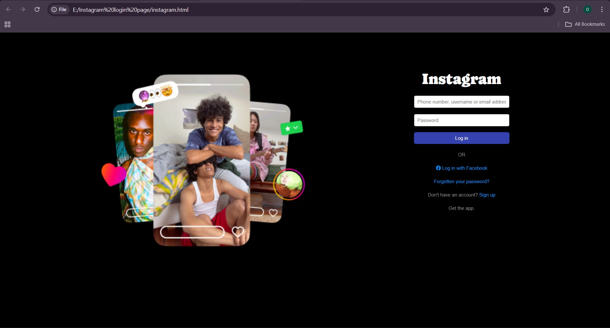

# 📱 Instagram Login Page (Static Clone)

This project is a **static front-end clone** of the Instagram login page.  
It is built using only **HTML and CSS**, focusing on layout design, responsive styling, and UI cloning practice.

---

## 🚀 Features
- 🎨 Pixel-perfect clone of Instagram’s login page  
- 📱 Responsive design for different screen sizes  
- 🔑 Login form with input fields and button styles  
- 🎭 Styled links (Facebook login, Forgot password, Sign up)  
- 🖼️ Side image carousel layout (similar to Instagram web)  

---

## 🛠️ Tech Stack
- **HTML**  
- **CSS**  

---

## 📸 Screenshot


---

## 📂 Project Setup

### 1. Clone the Repository
```bash
git clone https://github.com/omkarnerale18/Instagram-login-page.git
cd Instagram-login-page
# Open the project folder in Visual Studio Code
# Right-click on instagram.html
# Select "Open with Live Server"
# Or simply open instagram.html in your browser
